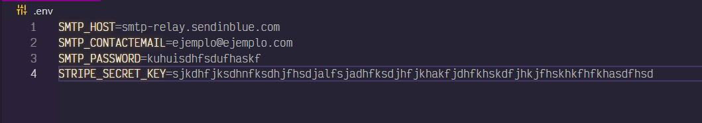
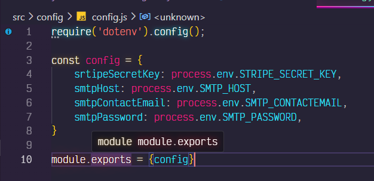

# Valki-games

## Preparar el proyecto
Comenzaremos ejecutando el comando `npm install`, que instalará todas las dependencias de nuestro "package.json", necesarias para el buen funcionamiento del proyecto.

## Preparar el proyecto
Para ejecutar el proyecto, utilizaremos el comando `npm run dev`.

## Nodemailer
Para el correcto funcionamiento del paquete "Nodemailer", es necesario utilizar un servicio SMTP, ya que se necesita un host, un email de contacto y una contraseña. 

En este proyecto se utiliza la plataforma **Brevo**, pero no se incluyen dichas credenciales, por lo que deben añadirse en el archivo ".env" e icnluirse en el archivo "config.js" de la carpeta "config".

## Stripe
Para el correcto funcionamiento de Stripe, se necesita la clave privada que nos proporciona esta plataforma cuando creamos una cuenta. 

La clave privade debe añadirse en el archivo ".env" e icnluirse en el archivo "config.js" de la carpeta "config".

